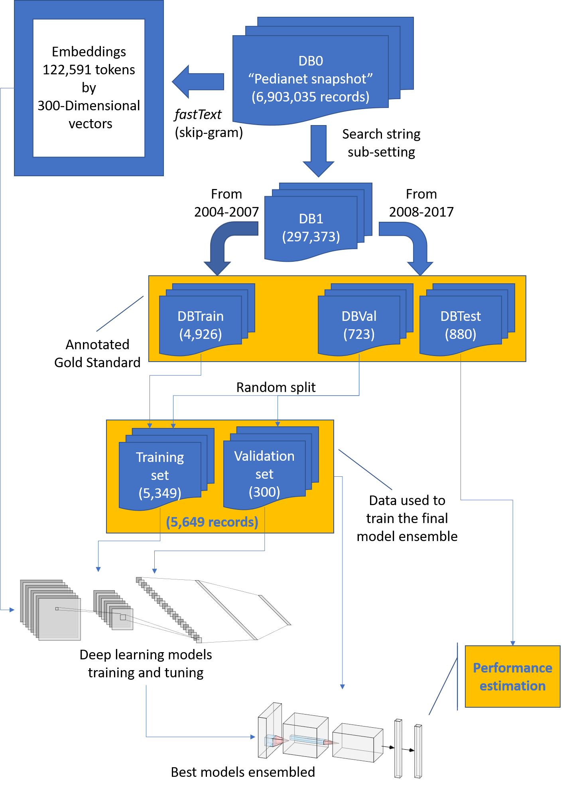
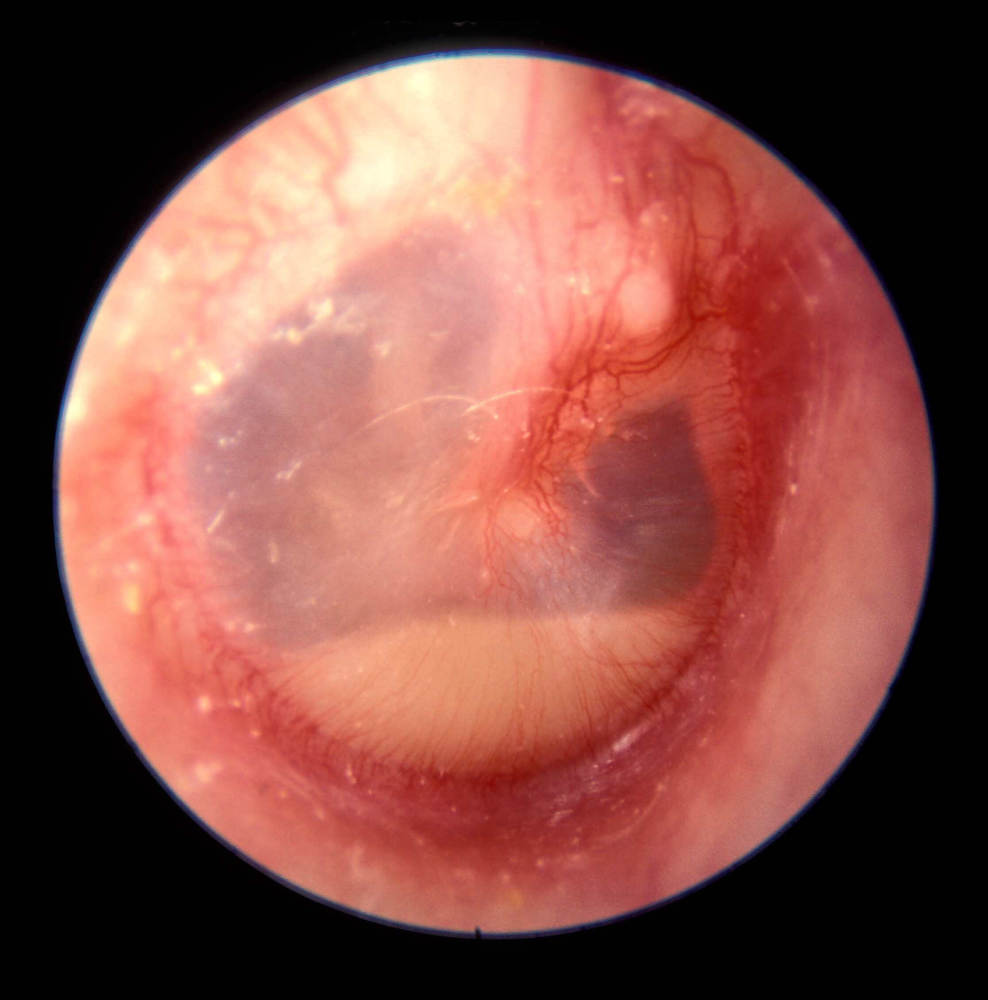
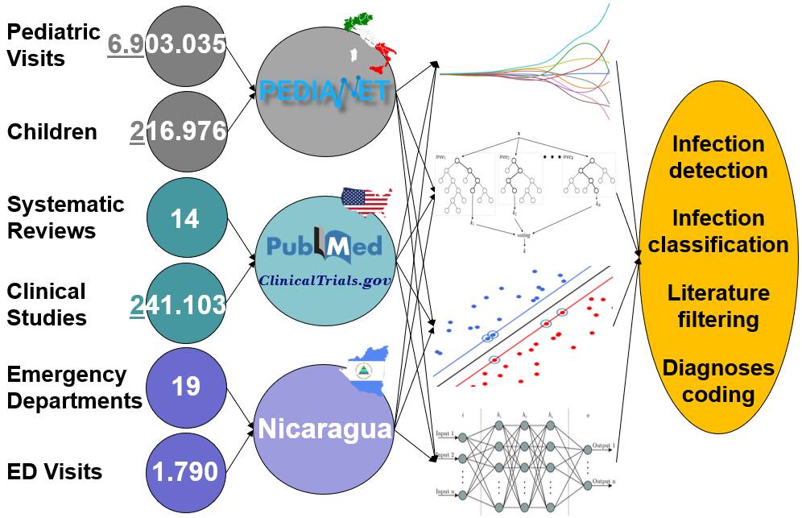

class: center, top, and title-slide
background-image: url("images/bg.png")
background-position: top
background-size: contain

```{r setup, include=FALSE}
options(htmltools.dir.version = FALSE)
```


# Development and Application of<br>Machine Learning Techniques for<br>Analyses and Classification of Free-Text<br>in Clinical Research

**Corrado Lanera**

.left[
<br>
<br>
**Ph.D. course in:** Traslational Specialistic Medicine "G.B. Morgagni"<br>
**Curriculum:** Biostatistics<br>
<br>
2020/03/17<br>
<br>
<br>
<br>
<br>
<br>
Department of Cardiac, Thoracic, Vascular Sciences, and Public Health<br>
University of Padova
]

???

Buongiorno


---
class: inverse, middle
# Outline

1. **Motivation:** _How can Free-Text analysis improve (help) clinical research?_

1. **Background 1:** _Machine Learning_

1. **Background 2:** _Natural Language Processing and Text Mining_

1. **Contributions:**

  - **Systematic Reviews**: _from `PubMed` to `ClinicalTrials.gov`_
  
  - **Emergency Departments' Visits**: _classification of discharge diagnoses_
  
  - **Electronic Health Records**:
    
      - _Case-detection of Varicella-Zoster Virus infections_
   
      - _Classification of otitis infections_

1. **Summary & Conclusion**

???

What we will talk about...


---
class: center, middle, inverse
# Motivation

---
class: center
background-image: url("images/clinical-texts.png")
background-position: bottom
background-size: contain

.pull-left[
### Documents' content
]
<!-- - Guidelines -->
<!-- - Research papers -->
<!-- - Trials' protocols -->

.pull-right[
### Clinical records
]
<!-- - Discharge notes -->
<!-- - Clinical reports -->
<!-- - Family doctors' diaries -->

### Social-Media

<!-- - General illness -->
<!-- - Adverse reactions -->
<!-- - Drugs (ab)use -->


???

bar


---
class: center, middle, inverse
# Background 1: Machine Learning

---
class: middle, center


Arthur Samuel (1959). **Machine Learning: Field of study that gives computers the ability to learn without being explicitly programmed.**

???

bar


---
class: middle, center

# (Shallow) Model definition
.pull-left[
Logistic regression 


<small><small><small><small>
<https://commons.wikimedia.org/wiki/File:Exam_pass_logistic_curve.jpeg>
</small></small></small></small>


k-nearest neighbor


<small><small><small>
<https://it.m.wikipedia.org/wiki/File:KnnClassification.svg>
</small></small></small>
]


.pull-right[
support-vector machine


<small><small><small>
<https://commons.wikimedia.org/wiki/File:Kernel_Machine.png>
</small></small></small>

random forest (decision tree)


<small><small><small><small><small><small>
<https://towardsdatascience.com/random-forests-and-decision-trees-from-scratch-in-python-3e4fa5ae4249>
]


---
class: center, middle

# (Artificial) Neuron


<small><small><small><small>
.right[<https://www.cs.iusb.edu/~danav/teach/c463/12_nn.html>]
</small></small></small></small>

<br>
<big>
<big>
<big>
<big>
$=g(\sum(w_ia_i))$


---
class: center, middle

# Fully connect


<small><small><small>
<https://upload.wikimedia.org/wikipedia/commons/thumb/e/e4/Artificial_neural_network.svg/860px-Artificial_neural_network.svg.png>


---
class: top

# .center[(Deep-)Learning]

.center[Tom Mitchell (1998). **Well-posed Learning Problem: A computer program is said to learn from experience E with respect to some task T and some performance measure P, if its performance on T, as measured by P, improves with experience E.**]


.pull-left[
1. Random initialization
1. Forward propagation
1. Loss evaluation
1. Back propagation
1. Optimization and update
]


.pull-right[

]
<small><small><small>.right[
<https://upload.wikimedia.org/wikipedia/commons/a/a3/Gradient_descent.gif>
]


---
class: center, middle, inverse
# Background 2: Natural Language processing and Text Mining


---
class: center

.pull-left[
# Search string

One or several strings (also called patterns) founded within a larger string or text.


<small><small><small><small><small><small><small>
<https://upload.wikimedia.org/wikipedia/commons/thumb/8/85/MeSH-example.svg/1024px-MeSH-example.svg.png>
</small></small></small></small></small></small></small>


<small><small><small><small><small>
<https://it.wikipedia.org/wiki/File:Boolean_operations_on_shapes.png>
</small></small></small></small></small>
]


.pull-right[
# Regular expressions

A sequence of characters that define a search pattern


<br><br>
<small><small><small>
<https://www.flickr.com/photos/bluesmoon/8458343489/in/photostream/>
</small></small></small>
]

???

bar


---
class: middle

# Preprocessing

- **removing** (removes noise):
  - remove non-word text
  - remove stopwords
  - strip whitespace

- **merging** (reduces the risk to allow important information to become noise because they are dispersed):
  - lowering
  - stemming
  - lemmatization

- **producing** (from words to “tokens”, i.e. single indivisible piece of information to bring information which could be lost otherwise, e.g. negations):
  - n-Grams (consecutive sequences of n words)


---
class: middle

# Sparse representation


<small><small><small>
<https://towardsdatascience.com/word-embedding-with-word2vec-and-fasttext-a209c1d3e12c>
</small></small></small>


---
class: middle


---
class: center, middle


<small><small><small><small>
.right[<https://www.analyticsvidhya.com/blog/2017/06/word-embeddings-count-word2veec/>]
</small></small></small>


---
class: center, middle


<small><small><small><small>
.right[<https://www.tensorflow.org/images/linear-relationships.png>]
</small></small></small></small>


---
class: middle, inverse

# .cener[Contributions]

<small>
Lanera, C., Minto, C., Sharma, A., Gregori, D., Berchialla, P., & baldi, I. (2018). **Extending PubMed Searches to ClinicalTrials.gov Through a Machine Learning Approach for Systematic Reviews**.<br>
_Journal of Clinical Epidemiology._ <small>https://doi.org/10.1016/j.jclinepi.2018.06.015</small>


Lanera, C., Berchialla,  P., Sharma, A., Minto, C., Gregori, D., & Baldi, I. (2019). **Screening PubMed Abstracts: is Class Imbalance Always a Challenge to Machine Learning?**<br>
_BMC Systematic Reviews._ <small>https://doi.org/10.1186/s13643-019-1245-8</small>


Lorenzoni, G., Bressan, S., Lanera, C., Azzolina, D., Da Dalt, L., & Gregori, D. (2019). **Analysis of Unstructured Text-Based Data Using Machine Learning Techniques: The Case of Pediatric Emergency Department Records in Nicaragua.**<br>
_Medical Care Research and Review._ <small>https://doi.org/10.1177/1077558719844123</small>


Lanera, C., Berchialla, P., Baldi, I., Lorenzoni, G., Tramontan, L., Scamarcia, A., Cantarutti, L., Giaquinto, C., & Gre-gori, D. (2019). **Use of Machine Learning techniques for case-detection of Varicella Zoster using routinely collected textual ambulatory records.**<br>
_Journal of Medical Internet Research._ <small>https://www.ncbi.nlm.nih.gov/pubmed/management/validator/93DC7C7BE977/citations/</small>


Lanera, C., Barbieri, E., Piras, G., Lorenzoni, G., Maggie, A., Weissenbacher, D., Doná, D., Scamarcia, A., Cantarutti, L, Gonzalez, G., Giacquinto, C., &  Gregori, D. (2020). **Automatic identification and classification of different types of otitis from free-text pediatric medical notes: a deep-learning approach.**
(Preprint)
</small>


???

bar


---
class: center, middle, inverse
# Systematic Reviews

**Extending PubMed Searches to ClinicalTrials.gov Through a Machine Learning Approach for Systematic Reviews**

**Screening PubMed Abstracts: is Class Imbalance Always a Challenge to Machine Learning?**


---

## Motivation

- Searching not only through standard databases leads to
  - Increase of patients from 10% to 50%
  - Change in statistics from 0% to 29%


<br>
<br>
<br>
<br>
<br>
<br>

- Despite their relevant role, clinical trial registries are under-utilized
  - No hierarchical branching structure
  - Text search is based on few fields
  - Cannot use queries’ combination


---

## Methods

14 Systematic reviews and Meta-analyses re-analyzed by 
Baudard et al.*

- Training (PubMED):
 - Positive : trials originally included in the systematic reviews
 - Negative: off topic trials randomly choosen (1/20)
- Test (ClinicalTrial.gov):
 - Positive : trials by Baudard et al. study
 - Negative: off topic trials randomly choosed (up to a set of 100)


- MLT (10-fold Cross-Validation):
 - GLM Net
 - k-NN
 - Random Forests
 - **Support-Vector Machine**


- Balancing methods:
 - Random Under-sampling
 - Random Over-sampling
 - 50:50
 - **35:65**

<small><small><small>Baudard M, Yavchitz A, Ravaud P, et al. **Impact of searching clinical trial registries in systematic reviews of pharmaceutical treatments: methodological systematic review and reanalysis of meta-analyses.** _BMJ_ (2017).</small></small></small>


???
Routine examination of registry databases deserves further
consideration since it may allow a more characterization of
publication and outcome reporting biases and improve the
validity of Systematic Reviews
The approach described here provides an automated solution
that can be tailored to address a variety of Clinical Trial-related
questions by building a comprehensive search on both literature
and registry databases.

---
class: center


---
class: center

#### SVM performances

ID | review       | manual |   mlt | delta     |   pos |  sens
--:| -------------|-------:|------:|----------:|------:|:------:
 1 | Yang Q       |     12 |   457 |    -445   |    18 |  1    
 2 | Meng Y       |     26 |   144 |    -118   |     9 |  1    
 3 | Segelov E    |    684 |   274 |     410   |    13 |  **0.875**
 4 | Li DH        |    201 |   289 |     -88   |     6 |  1    
 5 | Lv ZC        |    665 |   243 |     422   |    12 |  1    
 6 | Wang J       |    227 |   729 |    -502   |    32 |  1    
 7 | Zhou CQ      |      3 |   263 |    -260   |     9 |  1    
 8 | Liu X        |   1661 |   622 |  **1039** |    23 |  1    
 9 | Douxfils J   |     76 |   116 |     -40   |    13 |  1    
10 | Kourbeti IS  |    581 |   409 |     172   |    75 |  1    
11 | Li EC        |    909 |  2119 | **-1210** |     9 |  1    
12 | Cavender MA  |     71 |    60 |      11   |    14 |  1    
13 | Chatterjee S |    217 |   169 |      48   |    18 |  1    
14 | Funakoshi T  |   2680 |   711 |  **1969** |    43 |  1    


---
class: center, middle


---
class: center, middle, inverse
# Emergency Departments Visits

**Analysis of Unstructured Text-Based Data Using Machine Learning Techniques: The Case of Pediatric Emergency Department Records in Nicaragua.**
---

## Motivation


- Multi-source Multi-format Clinical Data

- Small dataset


???

ITALY-NICARAGUA COOPERATION PROGRAM

Started in 2011 
Italian and Nicaraguan pediatricians

AIMS
- Setting up a pediatric emergency clinical network in Nicaragua
- Improving Nicaraguan pediatric Emergency Care

DATA COLLECTION
established an electronic data collection system
9 Nicaraguan hospitals


---
class: center, middle


???

bar


---
class: center, middle, inverse
# Electronic Health Records

**Use of Machine Learning techniques for case-detection of Varicella Zoster using routinely collected textual ambulatory records.**

**Automatic identification and classification of different types of otitis from free-text pediatric medical notes: a deep-learning approach.**


---


<big><big>

2019  investigation

- data from 2010 to 2015 

- **on primary diagnosis only**

Adding the diaries in a traditional manual human-driven analysis proved to be 
**too costly** in terms both of person-time and economic resources


It is necessary to develop an **accurate** system able to **automatically**
classify all the  records by investigating **all the textual fields** in the database.

<small><small><small><small><small><small>\*Barbieri et.al "Antibiotic prescriptions in acute otitis media and pharyngitis in Italian pediatric outpatients", **Italian J. of Pediatrics** 2019</small></small></small></small></small></small>


???

- Otitis media is one of the **most common infections in pediatrics**
  population.

- It is an **inflamamtion with possible fluid accumulation** in the
  middle ear

- and there is continuing interest in defining the incidence and the
  burden of acute cases, being one of the main cause of antibiotics
  prescriptions in children.
  
- This is also highlighted by the **chellenges in the diagnoses** and by 
the **frequently little attention in following the guidlines**, like the
**wait-and-see approach** that discourage early antibiotics prescription,
reducing their usage and the adverse events associated with that.

Pedianet was investigated in 2019 by Barbieri et.al\* on data from 
2010 to 2015 for similar task **on primary diagnosis only**: adding even
the diaries in a traditional manual human-driven analysis proved to be 
too costly in terms both of person-time (years) and economic resources

It is necessary to develop an **accurate** system able to classify all
the Pedianet records **automatically** investigating **all the textual
fields** in the database.


---

## First Study on  

Aim: **comparing Machine Learning Techniques with application to Electronic Healt Records analysis for disease detection.**

Two distinct Italian regions’  dataset collected between 2004 and 2014 in:


- Veneto (training):
  - 7,631 patients 1,230,355 records
- Sicilia (test):
  - 2,347 patients and 569,926 records
  

- Records included dichotomous labels:
  - **non-case**
  - **case**


Technique	|     Accuracy	    |         F
----------|-------------------|-----------------
GLMNet  	| 86.6 (84.6–88.7)	| 36.5 (32.2–40.8)
MAXENT	  | 66.0 (56.4–75.5)	| 19.1 (17.2–20.9)
Boosting	| 96.0 (93.8–98.1)	| 68.5 (59.3–77.7)


???

bar

---
class: middle



#### Data

2004/01/01 to 2017/08/23
- 144 pediatricians
- 216,976 children


#### Classification task

<ol start="0">
<li><strong>other</strong> than an otitis case</li><br>
<li>an otitis case which is <strong>not media</strong></li><br>
<li>a media otitis which is <strong>not acute</strong></li><br>
<li>
  an AOM (<strong>w/o</strong> tympanic membrane perforation, nor recurrent)</li><br>
  
<li>
  an AOM with tympanic <strong>membrane perforation</strong></li><br><br>
<li>a <strong>recurrent</strong> AOM</li>
</ol>


.pull-right[
.footnote[<small><small><small><small>http://otitismedia.hawkelibrary.com</small></small></small></small>]
]

---
class: center, middle

Network                            |  Accuracy | Balanced<br>F1
-----------------------------------|  :------: | :------------:
**Annotator A**                    |   95.91   |      93.47 
**Annotator B**                    |   95.80   |      90.12 
**(Annotators' average)**          |  (95.86)  |     (91.80)
Simple Embedding                   |   81.70   |      75.75
Single Kernel                      |   94.66   |      92.23
Sequential CNN                     |   93.64   |      87.99
Parallel CNN                       | **96.59** |    **95.86**
Deep CNN                           | **96.25** |    **94.85**
Ensemble<br>(w/o Simple Embeddings)| **96.59** |    **95.47**

.pull-right[
  \* **Bold face** = over the annotators' maximum <br>
]


---
class: center, middle, inverse
# Summary & Conclusion

---
class: middle



???

bar


---
class: center, middle, inverse
<br>
<br>
<br>
<br>
<br>
<br>

# **Thank you<br>for the attention**

<br>
<br>
<br>
<br>
<br>
<br>
<br>
<br>
<br>
<br>
<br>

<small><small><small>Slides created via the R package [**xaringan**](https://github.com/yihui/xaringan) powered by [remark.js](https://remarkjs.com), [**knitr**](http://yihui.name/knitr), and [R Markdown](https://rmarkdown.rstudio.com).
